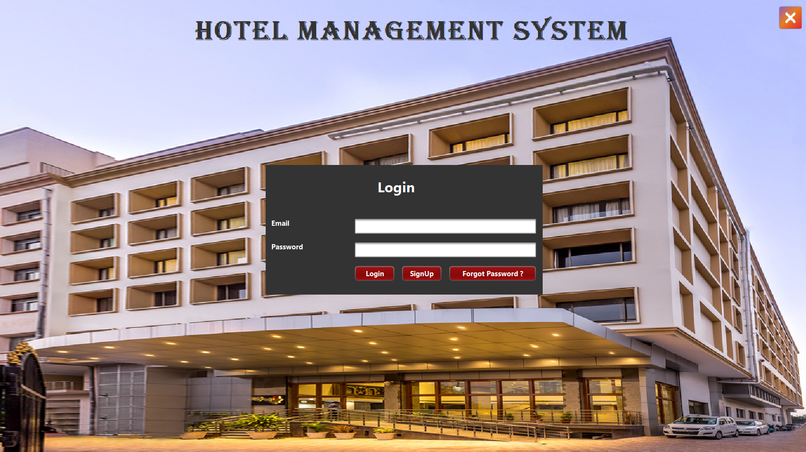

# HMS
HMS is a one stop solution for your Hotel Management System.It makes to manage and track your customer checkin and checkout details very easy.It allows you to manage your rooms,manage customers,billing with very minimum efforts. Time to shakehand with "HMS" 😊 

QUICK GUIDE/STEPS TO RUN THE PROJECT:
1. Clone the project.
2. Download and install NetbeansIDE.
3. Download and install MySQL installer community [ Workbench,MySQL command line ,MySQL Server ]
4. The Projects needs to have multiple tables to be in place,Open MySQL shell and create tables as below :
- CREATE TABLE hmsadmin (
    adminid int NOT NULL AUTO_INCREMENT PRIMARY KEY,
    name varchar(255) NOT NULL,
    email varchar(255) NOT NULL UNIQUE ,
    password varchar(50),
    securityquestion varchar(150),
    securityanswer varchar(150),
    accstatus varchar(10) DEFAULT 'false',
    address varchar(200)
   );
- CREATE TABLE rooms(
    roomnumber VARCHAR(100) UNIQUE  NOT NULL,
    roomtype VARCHAR(100) NOT NULL,
    bed varchar(100) NOT NULL,
    price int NOT NULL,
    status varchar(20) DEFAULT 'Not Booked'
   );
- CREATE TABLE customers(
    id int AUTO_INCREMENT UNIQUE  NOT NULL,
    name VARCHAR(100) NOT NULL,
    mobilenumber varchar(10) NOT NULL,
    nationality varchar(20) NOT NULL,
    gender varchar(20) NOT NULL,
    email varchar(100) NOT NULL,
    idproof varchar(100) NOT NULL,
    address varchar(200) NOT NULL,
    checkindate varchar(200) NOT NULL,
    checkoutdate varchar(200),
    days int ,
    totalamount int,
    room varchar(100) NOT NULL,
    FOREIGN KEY(room) references rooms(roomnumber)
   );
5. Open NetBeans IDE and open the cloned Project , and Click on Run Button.

# INSTRUCTION FOR ADMIN:
SuperAdmin is hardcoded in the project , hence register with below: \
USERNAME : ADMIN \
PASSWORD : ADMIN

- Register for other admins and it needs to be activated by SuperAdmin.
SuperAdmin only has the permissions to activate other admins registered.
- Admins can now add rooms and manage customer details from the DashBoard page.

Enjoy HMS !! 😊
